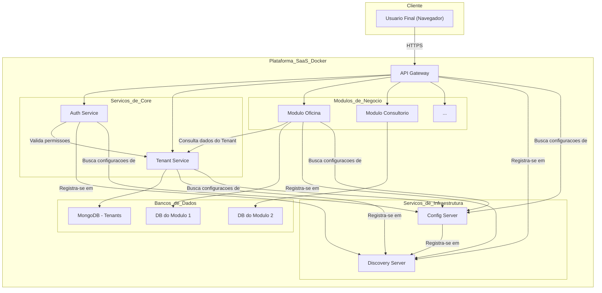

# Plataforma Multimodular SaaS

[](https://www.google.com/search?q=%5Bhttps://github.com/actions%5D\(https://github.com/actions\))
[](https://www.google.com/search?q=%5Bhttps://www.google.com/search%3Fq%3D./LICENSE%5D\(https://www.google.com/search%3Fq%3D./LICENSE\))

Uma plataforma robusta e escalável, construída em Java com Spring Boot, projetada para servir como um software como serviço (SaaS) multitenant. A arquitetura é baseada em microservices e visa oferecer diferentes módulos de negócio para clientes distintos de forma isolada e segura.

## 1\. Visão Geral da Plataforma

O objetivo deste projeto é criar uma única plataforma base que possa atender a diversos nichos de mercado através de módulos específicos. Por exemplo, a mesma plataforma pode servir um módulo de "Oficina Mecânica" para um cliente e um módulo de "Consultório Médico" para outro.

**Principais Conceitos:**

- **Multitenancy:** Uma única instância da aplicação serve múltiplos clientes (tenants), com total isolamento de dados e funcionalidades.
- **Modularidade:** As funcionalidades de negócio são encapsuladas em módulos independentes que podem ser "habilitados" para cada cliente de acordo com o plano contratado.

## 2\. Arquitetura da Plataforma

A plataforma adota uma **Arquitetura de Microservices** para garantir escalabilidade, resiliência e manutenibilidade. Cada serviço é um componente independente com suas próprias responsabilidades.

### 2.1. Diagrama de Contêineres (Modelo C4)

O diagrama abaixo ilustra a visão de alto nível dos principais serviços e como eles interagem.



## 3\. Estrutura de Módulos e Serviços

O repositório está organizado em três pastas principais que agrupam os serviços por responsabilidade:

### 📁 `core/` - Serviços Essenciais

| Serviço | Responsabilidade | Status |
| :--- | :--- |:--- |
| **`gateway`** | Ponto de entrada único para todas as requisições. Roteia, aplica filtros e agrega respostas usando **Spring Cloud Gateway**. | ✅ **Implementado** |
| **`tenant-service`** | Gerencia os clientes (tenants) e os módulos que eles assinam. | ✅ **Implementado** |
| **`auth-service`** | Cuida da autenticação (login/senha) e autorização (tokens JWT). | 📝 Planejado |

### 📁 `infra/` - Serviços de Infraestrutura

| Serviço | Responsabilidade | Status |
| :--- | :--- |:--- |
| **`discovery-server`** | Permite que os serviços se encontrem dinamicamente na rede, usando **Netflix Eureka**. | ✅ **Implementado** |
| **`config-server`** | Centraliza as configurações de todos os microservices a partir de um repositório Git, usando **Spring Cloud Config**. | ✅ **Implementado** |

### 📁 `modules/` - Módulos de Negócio

| Serviço | Responsabilidade | Status |
| :--- | :--- |:--- |
| **`mod-oficina`** | Exemplo de módulo para gerenciamento de uma oficina. | 📝 Planejado |
| **`mod-consultorio`** | Exemplo de módulo para agendamentos em um consultório. | 📝 Planejado |

## 4\. Arquitetura do Serviço Individual

Todos os serviços seguem o padrão de **Arquitetura Hexagonal (Portas e Adaptadores)** para isolar a lógica de negócio de detalhes de infraestrutura. Para mais detalhes, consulte o `README.md` de cada serviço.

## 5\. Ambiente de Desenvolvimento com Docker

Toda a plataforma é orquestrada com Docker e Docker Compose para um ambiente de desenvolvimento consistente.

### 5.1. Pré-requisitos

- Git
- JDK 21 (LTS)
- Maven 3.8+
- Docker e Docker Compose

### 5.2. Como Executar a Plataforma

1.  Clone este repositório e o repositório de configurações (`plataforma-config`).
2.  Na pasta raiz deste projeto, execute o comando:
    ```bash
    docker-compose up --build
    ```
3.  O comando irá construir e iniciar todos os contêineres em ordem de dependência.

### 5.3. Acesso à Plataforma

Após a execução, **toda a interação com a plataforma deve ser feita através do API Gateway**. Os dashboards de infraestrutura também podem ser acessados diretamente.

| Ponto de Acesso      | URL de Acesso          | Descrição                                                                               |
| :------------------- | :--------------------- | :-------------------------------------------------------------------------------------- |
| **API Gateway** | `http://localhost:8080`  | **Ponto de entrada principal.** Todas as chamadas de API devem ser direcionadas para cá. |
| **Discovery Server** | `http://localhost:8761`  | Dashboard do Eureka para monitorar os serviços registrados.                               |
| **Config Server** | `http://localhost:8888`  | API do Servidor de Configuração para inspecionar as propriedades servidas.                |

## 6\. Documentação e Monitoramento

Esta seção serve como um guia prático para explorar e interagir com os componentes da plataforma.

### 6.1. Ponto de Entrada: API Gateway

O `API Gateway` na porta `8080` é o único ponto de contato com o exterior. Ele roteia as requisições para os serviços internos com base no caminho da URL.

**Principais Rotas Mapeadas:**

| Rota no Gateway | Serviço de Destino | Exemplo de Acesso (Método GET) |
| :--- | :--- | :--- |
| `/api/v1/tenants/**` | `tenant-service` | [`http://localhost:8080/api/v1/tenants`](https://www.google.com/search?q=http://localhost:8080/api/v1/tenants) |

### 6.2. Monitoramento de Serviços (Eureka Dashboard)

O dashboard do **Eureka** é a principal ferramenta para verificar a saúde do ecossistema.

- **URL:** [**http://localhost:8761**](https://www.google.com/search?q=http://localhost:8761)

**O que procurar:** Dentro do dashboard, na seção `Instances currently registered with Eureka`, você encontrará os seguintes serviços com o status `UP`:

- `TENANT-SERVICE`
- `CONFIG-SERVER`
- `GATEWAY`

### 6.3. Configuração Centralizada (Config Server)

As configurações são versionadas em um [repositório Git dedicado](https://github.com/Augusto-Lucas-Sistemas/plataforma-config) e servidas pelo **Spring Cloud Config**. Você pode inspecionar as configurações que cada serviço está recebendo.

**Inspeção de Configurações por Serviço:**

| Serviço | URL para Inspeção do Profile `default` |
| :--- | :--- |
| `gateway` | [`http://localhost:8888/gateway/default`](https://www.google.com/search?q=http://localhost:8888/gateway/default) |
| `tenant-service` | [`http://localhost:8888/tenant-service/default`](https://www.google.com/search?q=http://localhost:8888/tenant-service/default) |
| `discovery-server` | [`http://localhost:8888/discovery-server/default`](https://www.google.com/search?q=http://localhost:8888/discovery-server/default) |

### 6.4. Documentação e Testes de API

Para interagir e testar a API, utilize as ferramentas abaixo. Lembre-se que todas as chamadas devem passar pelo Gateway.

#### Coleção do Postman/Insomnia

O projeto inclui uma coleção centralizada para facilitar os testes.

- **Arquivo:** `postman_collection.json` (localizado na raiz do projeto).
- **Uso:** Importe este arquivo no seu cliente de API. A variável `baseUrl` já está pré-configurada para `http://localhost:8080`.

**Principais Endpoints de Exemplo (via Gateway):**

| Método | Endpoint no Gateway | Descrição |
| :--- | :--- | :--- |
| `GET` | `/api/v1/tenants` | Lista todos os tenants. |
| `POST` | `/api/v1/tenants` | Cria um novo tenant (veja `body` na coleção). |

#### Swagger UI

A documentação interativa de cada serviço pode ser acessada através das rotas do Gateway. A configuração para uma interface unificada será adicionada futuramente.

## 7\. Próximos Passos

Com a infraestrutura de base (Service Discovery, Config Server e API Gateway) implementada, o próximo passo é focar na segurança:

1.  Implementar o **`auth-service`** para gerenciar autenticação e autorização com JWT.
2.  Integrar o `auth-service` ao `gateway` para proteger os endpoints.
3.  Expandir as funcionalidades dos serviços de negócio (ex: `tenant-service`).

Ao contribuir, por favor, siga os padrões de arquitetura e documentação já estabelecidos.