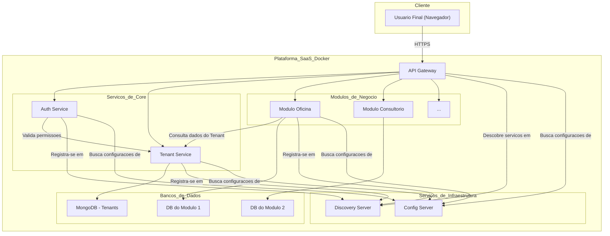

# Plataforma Multimodular SaaS

[](https://www.google.com/search?q=%5Bhttps://github.com/actions%5D\(https://github.com/actions\))
[](https://www.google.com/search?q=%5Bhttps://www.google.com/search%3Fq%3D./LICENSE%5D\(https://www.google.com/search%3Fq%3D./LICENSE\))

Uma plataforma robusta e escalável, construída em Java com Spring Boot, projetada para servir como um software como serviço (SaaS) multitenant. A arquitetura é baseada em microservices e visa oferecer diferentes módulos de negócio para clientes distintos de forma isolada e segura.

## 1\. Visão Geral da Plataforma

O objetivo deste projeto é criar uma única plataforma base que possa atender a diversos nichos de mercado através de módulos específicos. Por exemplo, a mesma plataforma pode servir um módulo de "Oficina Mecânica" para um cliente e um módulo de "Consultório Médico" para outro.

**Principais Conceitos:**

- **Multitenancy:** Uma única instância da aplicação serve múltiplos clientes (tenants), com total isolamento de dados e funcionalidades.
- **Modularidade:** As funcionalidades de negócio são encapsuladas em módulos independentes que podem ser "habilitados" para cada cliente de acordo com o plano contratado.

## 2\. Arquitetura da Plataforma

A plataforma adota uma **Arquitetura de Microservices** para garantir escalabilidade, resiliência e manutenibilidade. Cada serviço é um componente independente, com suas próprias responsabilidades e, em muitos casos, seu próprio banco de dados.

### 2.1. Diagrama de Contêineres (Modelo C4)

O diagrama abaixo ilustra a visão de alto nível dos principais serviços e como eles interagem.



## 3\. Estrutura de Módulos e Serviços

O repositório está organizado em três pastas principais que agrupam os serviços por responsabilidade:

### 📁 `core/` - Serviços Essenciais

Serviços que formam o núcleo da plataforma.

| Serviço | Responsabilidade | Status |
| :--- | :--- |:--- |
| **`tenant-service`** | Gerencia os clientes (tenants) e os módulos que eles assinam. | ✅ **Implementado** |
| **`auth-service`** | Cuida da autenticação (login/senha) e autorização (tokens JWT). | 📝 Planejado |
| **`gateway`** | Ponto de entrada único (Single Point of Entry) para todas as requisições externas. Roteia, aplica filtros de segurança e agrega respostas. | 📝 Planejado |

### 📁 `infra/` - Serviços de Infraestrutura

Serviços que dão suporte à arquitetura de microservices.

| Serviço | Responsabilidade | Status |
| :--- | :--- |:--- |
| **`discovery-server`** | Permite que os serviços se encontrem dinamicamente na rede (Service Discovery), usando **Netflix Eureka**. | ✅ **Implementado** |
| **`config-server`** | Centraliza as configurações de todos os microservices em um único local. | 📝 Planejado |

### 📁 `modules/` - Módulos de Negócio

Módulos específicos de cada nicho de mercado, contendo a lógica de negócio do cliente final.

| Serviço | Responsabilidade | Status |
| :--- | :--- |:--- |
| **`mod-oficina`** | Exemplo de módulo para gerenciamento de uma oficina. | 📝 Planejado |
| **`mod-consultorio`** | Exemplo de módulo para agendamentos em um consultório. | 📝 Planejado |

## 4\. Arquitetura do Serviço Individual

Todos os serviços seguem o padrão de **Arquitetura Hexagonal (Portas e Adaptadores)** para isolar a lógica de negócio de detalhes de infraestrutura (APIs REST, bancos de dados, etc.). Para mais detalhes, consulte o `README.md` de cada serviço.

## 5\. Ambiente de Desenvolvimento com Docker

Toda a plataforma é orquestrada com Docker e Docker Compose para um ambiente de desenvolvimento consistente.

### 5.1. Pré-requisitos

- Git
- JDK 21 (LTS)
- Maven 3.8+
- Docker e Docker Compose

### 5.2. Como Executar a Plataforma

1.  Clone este repositório.
2.  Na pasta raiz do projeto, execute o comando:
    ```bash
    docker-compose up --build
    ```
3.  O comando irá construir as imagens de cada serviço e iniciar todos os contêineres.

### 5.3. Acesso aos Serviços

Após a execução, os principais pontos de acesso estarão disponíveis em `localhost`:

| Serviço | URL de Acesso | Descrição |
| :--- | :--- | :--- |
| **Discovery Server** | `http://localhost:8761` | Dashboard do Eureka para monitorar os serviços registrados. |
| **Tenant Service** | `http://localhost:8081` | Acesso direto à API do serviço de tenants (para testes). |
| **API Gateway** | `http://localhost:8080` | (Planejado) Ponto de entrada único para a plataforma. |

## 6\. Documentação e Monitoramento

### 6.1. Monitoramento de Serviços (Eureka Dashboard)

Com a plataforma no ar, o dashboard do **Eureka (Discovery Server)** é a principal ferramenta para verificar a saúde do ecossistema de microservices.

- **URL:** `http://localhost:8761`

Ao acessá-lo, você pode ver a lista de todas as instâncias de serviços que estão ativas e registradas na plataforma, como o `TENANT-SERVICE`.

### 6.2. Documentação de API (Swagger)

Cada microserviço gera sua própria documentação interativa usando **Swagger UI**.

- **Swagger UI (Tenant Service):** `http://localhost:8081/swagger-ui.html`

Use a interface do Swagger para explorar e testar os endpoints de cada API individualmente.

### 6.3. Coleção de Testes (Postman/Insomnia)

Uma coleção centralizada do Postman/Insomnia para testes de integração está localizada na raiz do projeto (`postman_collection.json`). Ela contém requisições para todos os módulos, organizadas em pastas.

> **Nota:** Ao adicionar ou modificar endpoints, lembre-se de atualizar esta coleção central.

## 7\. Próximos Passos

Este é um projeto em evolução. Com a base de `Service Discovery` implementada, os próximos passos incluem:

1.  Implementar o **`config-server`** para centralizar as configurações.
2.  Implementar o **`auth-service`** para cuidar da autenticação e autorização.
3.  Implementar o **`gateway`** como ponto de entrada único da API.

Ao contribuir, por favor, siga os padrões de arquitetura e documentação já estabelecidos.