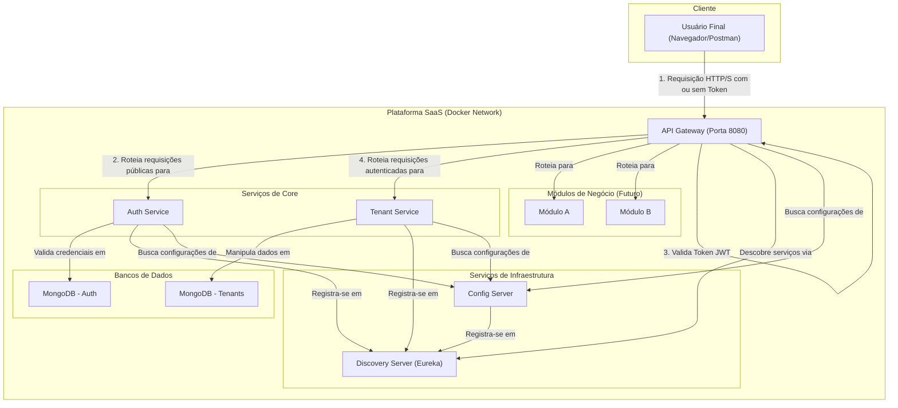

# Plataforma Multimodular SaaS

Uma plataforma robusta e escalável, construída em Java com Spring Boot e Spring Cloud, projetada para servir como um software como serviço (SaaS) multitenant. A arquitetura é baseada em microservices, orquestrada com Docker, e visa oferecer diferentes módulos de negócio para clientes distintos de forma isolada e segura.

## 1\. Visão Geral da Plataforma

O objetivo deste projeto é criar uma única plataforma base que possa atender a diversos nichos de mercado através de módulos específicos. Por exemplo, a mesma plataforma pode servir um módulo de "Oficina Mecânica" para um cliente e um módulo de "Consultório Médico" para outro.

**Principais Conceitos:**

- **Multitenancy:** Uma única instância da aplicação serve múltiplos clientes (tenants), com total isolamento de dados.
- **Modularidade:** As funcionalidades de negócio são encapsuladas em módulos independentes que podem ser habilitados para cada cliente.
- **Segurança Centralizada:** O acesso a todos os serviços de negócio é protegido e gerenciado de forma centralizada no API Gateway, usando autenticação baseada em Tokens JWT.

## 2\. Arquitetura da Plataforma

A plataforma adota uma **Arquitetura de Microservices** para garantir escalabilidade, resiliência e manutenibilidade. Cada serviço é um componente independente com suas próprias responsabilidades.

### 2.1. Diagrama de Contêineres (Modelo C4)

O diagrama abaixo ilustra a visão de alto nível dos principais serviços e como eles interagem.



## 3\. Estrutura de Módulos e Serviços

O repositório está organizado em três pastas principais:

### 📁 `core/` - Serviços Essenciais

| Serviço            | Responsabilidade                                                                                     | Status            |
| :----------------- | :--------------------------------------------------------------------------------------------------- | :---------------- |
| **`gateway`** | Ponto de entrada único. Roteia o tráfego e **impõe a segurança**, validando tokens JWT.               | ✅ **Implementado** |
| **`auth-service`** | Gerencia usuários, senhas, e **emite os tokens JWT** após uma autenticação bem-sucedida.              | ✅ **Implementado** |
| **`tenant-service`** | Gerencia os clientes (tenants) e os módulos que eles assinam. (Serviço de exemplo protegido).       | ✅ **Implementado** |

### 📁 `infra/` - Serviços de Infraestrutura

| Serviço              | Responsabilidade                                                                      | Status            |
| :------------------- | :------------------------------------------------------------------------------------ | :---------------- |
| **`discovery-server`** | Permite que os serviços se encontrem dinamicamente na rede, usando **Netflix Eureka**. | ✅ **Implementado** |
| **`config-server`** | Centraliza as configurações de todos os microservices a partir de um repositório Git.  | ✅ **Implementado** |

### 📁 `modules/` - Módulos de Negócio

| Serviço             | Responsabilidade                                              | Status      |
| :------------------ | :------------------------------------------------------------ | :---------- |
| **`mod-oficina`** | Exemplo de módulo para gerenciamento de uma oficina.          | 📝 Planejado |
| **`mod-consultorio`** | Exemplo de módulo para agendamentos em um consultório.        | 📝 Planejado |

## 4\. Arquitetura do Serviço Individual

Todos os serviços seguem o padrão de **Arquitetura Hexagonal (Portas e Adaptadores)** para isolar a lógica de negócio de detalhes de infraestrutura. Para mais detalhes, consulte o `README.md` de cada serviço.

## 5\. Ambiente de Desenvolvimento com Docker

### 5.1. Pré-requisitos

- Git
- JDK 21 (LTS)
- Maven 3.8+
- Docker e Docker Compose

### 5.2. Como Executar a Plataforma

1.  Clone este repositório e o repositório de configurações (`plataforma-config`).
2.  Na pasta raiz deste projeto, execute o comando:
    ```bash
    docker-compose up --build
    ```
3.  O comando irá construir e iniciar todos os contêineres. Aguarde até que todos os serviços estejam saudáveis (healthy) antes de iniciar os testes.

### 5.3. Acesso à Plataforma e Ferramentas

Toda a interação com a plataforma deve ser feita através do API Gateway. Os dashboards de infraestrutura podem ser acessados diretamente.

| Ponto de Acesso      | URL de Acesso               | Descrição                                                                      |
| :------------------- | :-------------------------- | :----------------------------------------------------------------------------- |
| **API Gateway** | `http://localhost:8080`     | **Ponto de entrada principal.** Todas as chamadas de API devem passar por aqui.      |
| **Discovery Server** | `http://localhost:8761`     | Dashboard do Eureka para monitorar os serviços registrados.                      |
| **Config Server** | `http://localhost:8888`     | API para inspecionar as configurações servidas pelo Config Server.             |
| **Auth Service** | `http://localhost:8082`     | Acesso direto ao Auth Service (para debug, mas o ideal é usar o Gateway).       |

## 6\. Guia de Exploração e Testes

Esta seção serve como um guia prático para explorar e interagir com os componentes da plataforma.

### 6.1. Monitoramento de Serviços (Eureka Dashboard)

Acesse o dashboard do **Eureka** para verificar a saúde do ecossistema.

- **URL:** [**http://localhost:8761**](https://www.google.com/search?q=http://localhost:8761)

**O que procurar:** Na seção `Instances currently registered with Eureka`, você deve encontrar todos os serviços com o status `UP`:

- `AUTH-SERVICE`
- `CONFIG-SERVER`
- `DISCOVERY-SERVER` (geralmente não se registra, mas pode aparecer)
- `GATEWAY`
- `TENANT-SERVICE`

### 6.2. Configuração Centralizada (Config Server)

As configurações são versionadas no [repositório `plataforma-config`](https://www.google.com/search?q=%5Bhttps://github.com/Augusto-Lucas-Sistemas/plataforma-config%5D\(https://github.com/Augusto-Lucas-Sistemas/plataforma-config\)) e servidas pelo **Spring Cloud Config**. Você pode inspecionar as configurações que cada serviço está recebendo:

| Serviço          | URL para Inspeção do Profile `default`                                |
| :--------------- | :-------------------------------------------------------------------- |
| `auth-service`   | [`http://localhost:8888/auth-service/default`](https://www.google.com/search?q=http://localhost:8888/auth-service/default) |
| `gateway`        | [`http://localhost:8888/gateway/default`](https://www.google.com/search?q=http://localhost:8888/gateway/default)         |
| `tenant-service` | [`http://localhost:8888/tenant-service/default`](https://www.google.com/search?q=http://localhost:8888/tenant-service/default) |

### 6.3. Documentação e Testes de API

A forma mais fácil de testar é usando a coleção automatizada para Postman/Insomnia.

- **Arquivo:** `postman_collection.json` (localizado na raiz do projeto).
- **Uso:** Importe este arquivo. Ele contém um fluxo de trabalho automatizado:
    1.  Execute a requisição **"Auth Service \> 1. Registrar Novo Usuário"**.
    2.  Execute **"Auth Service \> 2. Autenticar (Login)"**. O token JWT será salvo automaticamente.
    3.  Agora você pode executar qualquer rota protegida, como **"Tenant Service \> 2. Listar Todos os Tenants"**, e o token será enviado.

#### Acesso à Documentação Swagger

A documentação interativa de cada serviço pode ser acessada através das rotas do Gateway:

- **Auth Service:** [`http://localhost:8080/auth/swagger-ui.html`](https://www.google.com/search?q=http://localhost:8080/auth/swagger-ui.html)
- **Tenant Service:** [`http://localhost:8080/api/v1/tenants/swagger-ui.html`](https://www.google.com/search?q=http://localhost:8080/api/v1/tenants/swagger-ui.html)

## 7\. Próximos Passos

Com a infraestrutura e a segurança de base implementadas, os próximos passos são:

1.  **Refinar Autorização:** Implementar lógica baseada em `Roles` (ex: apenas `ROLE_ADMIN` pode listar todos os usuários).
2.  **Construir Módulos de Negócio:** Começar a desenvolver os `modules/`, como o `mod-oficina`, seguindo o padrão já estabelecido.
3.  **Adicionar Logging/Tracing Distribuído:** Integrar ferramentas como OpenTelemetry ou Micrometer Tracing para monitorar requisições através de múltiplos serviços.